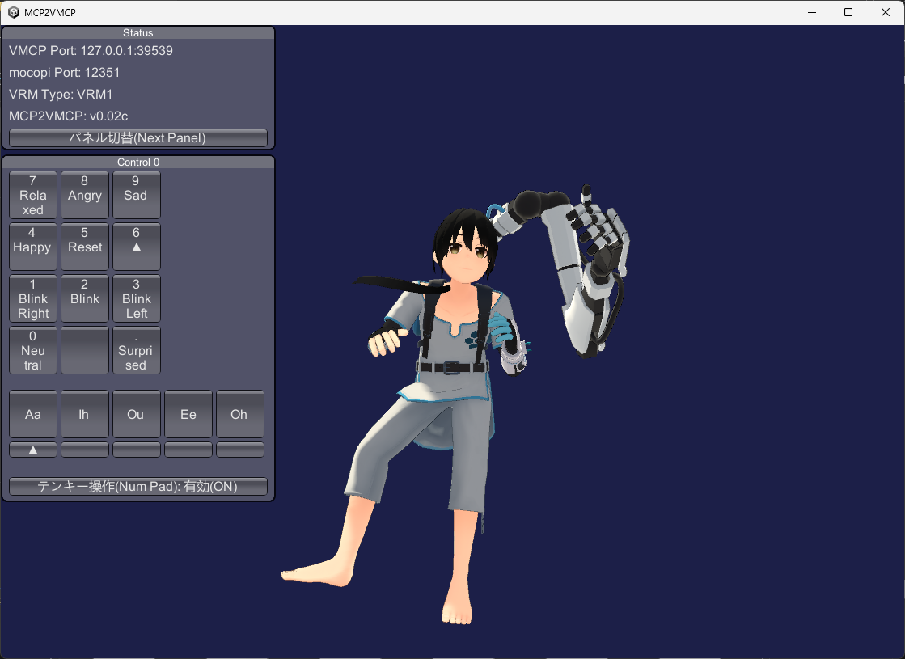
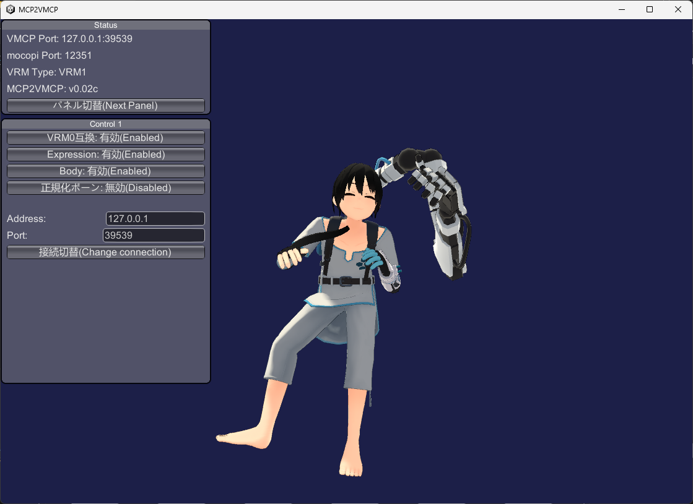

# MCP2VMCP
[mocopi](https://www.sony.jp/mocopi/)の姿勢情報を、[VMCProtocol](https://sh-akira.github.io/VirtualMotionCaptureProtocol/)で送信するソフトウェア。  

主にVRM1環境の[EVMC4U](https://github.com/gpsnmeajp/EasyVirtualMotionCaptureForUnity)の利用や[VMCProtocol](https://sh-akira.github.io/VirtualMotionCaptureProtocol/)のテストに使用することを想定しているため、高度な機能や保存機能を提供していません。  
非常に簡易的な機能ですが、VRM0とVRM1の両方に対応しています。  

WindowsとMacに対応しています。

※配信に耐えうる高度な機能や高品質さを求める場合は、Sony公式でも紹介されている[バーチャルモーションキャプチャー](https://vmc.info/)を推奨します。

v0.02c: VRM1のボーンセットアップが不完全な問題を修正、テンキー操作により表情を操作する機能と、接続先を変更する機能、ファイル読み込みダイアログなどを実装しました。

**[ダウンロード](https://github.com/gpsnmeajp/MCP2VMCP/releases)**  

</img>

[VMC Protocol対応](https://sh-akira.github.io/VirtualMotionCaptureProtocol/)  

</img> </img>

## How to use
+ VRMファイルを選択します。
+ [mocopiアプリからのデータ送信方法](https://www.sony.net/Products/mocopi-dev/jp/documents/ReceiverPlugin/SendData.html)
+ 体が動くことを確認したら、表情ボタンあるいはテンキーで表情を変更できます。
+ [EVMC4U](https://github.com/gpsnmeajp/EasyVirtualMotionCaptureForUnity)などの受信アプリケーションを開きます。[EVMC4U](https://github.com/gpsnmeajp/EasyVirtualMotionCaptureForUnity)など自動ロードに対応しているソフトウェアの場合は、自動でモデルが読み込まれます。

## License
SampleBonesSendBundle.cs(VMCProtocol公式サンプルの改造品)のライセンスはCC0です。(ソースコード先頭に記載)  
本ソフトウェアの再配布やプロジェクトの再利用はMITライセンスに従ってください。

利用OSSのライセンスは、zipファイル内の3rdpartylicenses(ExternalReceiverPack).txtをご確認ください。  

本ソフトウェアの利用は、mocopi SDK 利用規約と同等の条件で可能です。  

## Screenshots
</img>  
</img>  
</img>  
</img>  

# [お問合せ先(Discordサーバー)](https://discord.gg/nGapSR7)
**本ソフトウェアは、開発者向けを想定しており、積極的なサポートは提供していません**  
**This software is intended for developers and does not provide active support.**  
